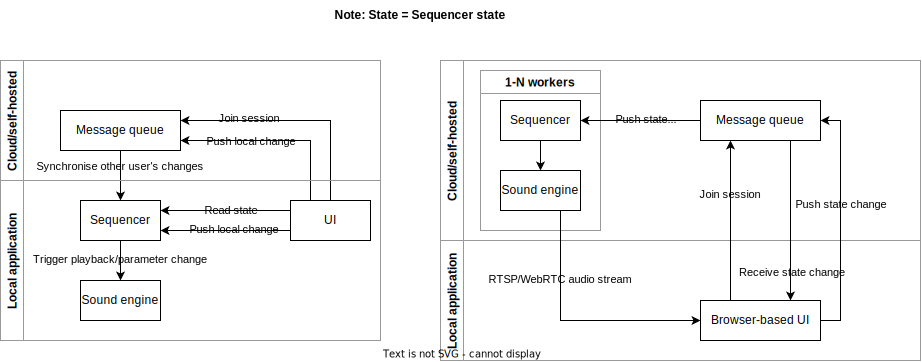

# Libretakt

Zmiana żeby coś było

Project name based on Elektron's [Digitakt](https://www.elektron.se/us/digitakt-explorer) (but free/libre/etc).

## Learning resources

- Audio playback - [Rodio](https://github.com/RustAudio/rodio)
- UI - [MacroQuad](https://macroquad.rs/)
- Music genre classification:
  - [python tools overview](https://farranaanjum05.medium.com/music-genre-classification-with-python-51bff77adfd6)
  - [GTZAN dataset](https://www.kaggle.com/datasets/andradaolteanu/gtzan-dataset-music-genre-classification)
- On mutexes and audio processing - [using locks in real-time audio processing](Using locks in real-time audio processing, safely)

## Component diagram

```mermaid
flowchart TD
    subgraph Client
        cSeq[Sequencer]--send playback events-->cEng
        cEng[DSP engine]
        cCont[Controller]--apply state change-->cSeq
        cUI[UI]--read state-->cSeq
        cUI--send state change<br>join/create session-->cCont
    end

    cCont--send state change<br>join/create session-->sync
    sync--synchronise state<br>with other uses-->cCont

    subgraph Web-hosted
        direction RL;
        subgraph hC[Headless client - spawned per session]
            Controller--apply state change-->Sequencer
            Sequencer--send playback events-->e[DSP engine]
        end
        sync[Synchronisation<br>service]
        sync--send state change-->Controller
        e-->stream
        stream[Streaming service]
    end
```

## Class diagram

```mermaid
classDiagram
    class Engine {
        sequencer: SmartPointer~Sequencer~
        voices: Vec[Voice]

        next() Rodio requirement
    }

    Engine --> Sequencer: Engine calls tick() in the sequencer, <br>triggering events and passing its voices

    class Sequencer {
        tracks: Vec[Track]
        tick(&mut voices)
    }

    class UI {
        sequencer: SmartPointer~Sequencer~
        controller: SmartPointer~Controller~
        draw()
    }

    class Controller {
        sequencer: SmartPointer~Sequencer~
        websocket_worker: Thread? idk
        set_parameter(track, pattern, step_num, step)
    }

    Controller -->Sequencer: Controller mutates the sequencer state,<br>either because of user input or because<br>of received websocket events
    Controller <-- UI: Handle parameter change events
    UI --> Sequencer: UI reads the sequencer state

    class Track {
        playback_parameters: PlaybackParameters
        patterns: Vec[Pattern],
        current_pattern: int,
        current_step: int,
    }

    Track *-- Pattern : Patterns refer to different melodies, that <br>can be dynamically switched by users

    class Pattern {
        steps: Vec[Step]
    }

    Pattern *-- Step: Step plays a sound, optionally<br> overriding playback parameters

    class PlaybackParameters {
        parameters: [u8]

        merge(Step) PlaybackParameters
    }

    Track *-- PlaybackParameters

    class Step {
        parameters: [Option~u8~]
    }

    Sequencer *-- Track

    class Voice {
        sample_provider: SampleProvider
        play_position: float
        playback_parameters: PlaybackParameters
    }

    Voice *-- PlaybackParameters
    Engine *-- Voice

    SynchronisationService <--> Controller: Synchronise changes across users<br>within the same session

    class SynchronisationService {
        sessions: Map~session_token: String, connected_clients: WebsocketConnections~
        join_or_create_session(token, nickname)
        set_parameter(track, pattern, step_num, step)
        parameter_changes_subscription(): Stream of updates(track, pattern, step_num, step)
    }
```

## Gantt

```mermaid
gantt
    title Rozkład jazduni
    dateFormat  YYYY-MM-DD

    section Web
    POC serwer websocket    :w1, 2022-10-15, 7d
    POC serializacja&deserializacja Cap'n'Proto  : 2022-10-15, 7d
    Testy synchronizacji stanu za pomocą Cap'n'Proto  : 7d

    section Logika biznesowa
    Mechanizm synchronizacji stanu :crit, 2022-10-15, 7d
    Zapisywanie stanu sequencera: 7d
    Blockowanie ścieżek na jednego użytkownika: 7d

    section UI
    Widgety z wizualizacją parametrów   :crit, 2022-10-15, 7d
    Podpięcie sequencera do widgetów   :crit, 7d
    Podgląd i edycja sekwencji : 7d
    Obsługa parameter locks : 7d
    Obsługa przełączania ścieżek i patternów : 7d

    section DSP&Sequencing
    Filtry na audio :2022-10-15, 7d
    Efekty reverb + delay : 7d
    (AMP + Filter) ADSR: 7d
```

## Do rozpisania

1. Wymagania funkcjonalne i niefunkcjnalne:
  - Zdefiniowanie czemu dana technologia została wybrana ("najlepiej spełnia wymagania XXX ponieważ YYY")
2. Zamodelowanie procesów oddziaływania użytkownika z systemem
3. Opis komunikacji między komponentami w systemie
4. Rozmieszczenie komponentw systemu

### Gotowy plan raportu z wykładu xd

#### Wstęp

1. Opis rzeczywistości, w której funkcjonuje system
2. Opis klas obiektów występujących w rzeczywistości (modelowanie)
3. Opis atrybutów tychże klas
4. Opis relacji

#### Opis zadań

1. Diagram przypadków użycia
2. Flow chart
3. Sequence diagram

#### Opis procesów

"Proces biznesowy" - opisanie jakie procesy realizuje aplikacja z perspektywy użytkownika

#### Opis wymiany komunikatów

Mówił o tym tak, jakby było dla niego ważne.

1. Opis/definicja wiadomości
2. Opis sekwencji wysyłania wiadomości

#### Opis rozmieszczenia komponentów

VPS/VM/Dockerki, inne takie

## Old diagram

```mermaid
graph TD
    SEQ[Sequencer]
    SOUND[Sound Engine]
    UI[User interface] -->|Read state| SEQ
    UI-->|Edit state| SEQ
    MQ[Message queue]
    SEQ-->|Emit trigger| SOUND
    MQ-->|Propagate state changes from other users|SEQ
    UI-->|Send edit state event|MQ
    SOUND-->|sample state visualisation|UI
```

